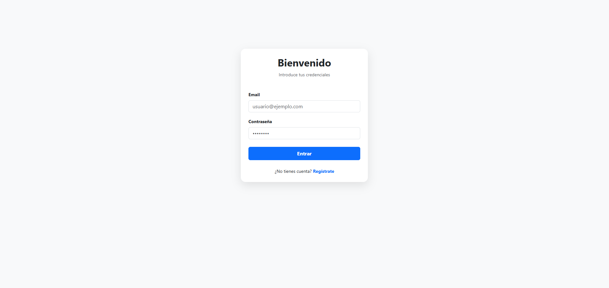
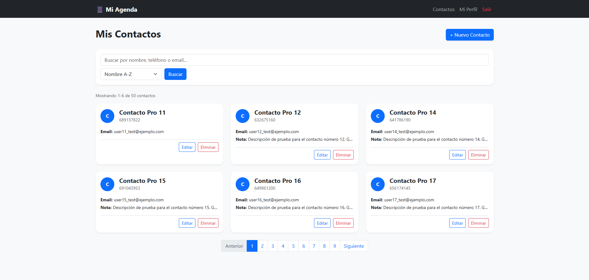
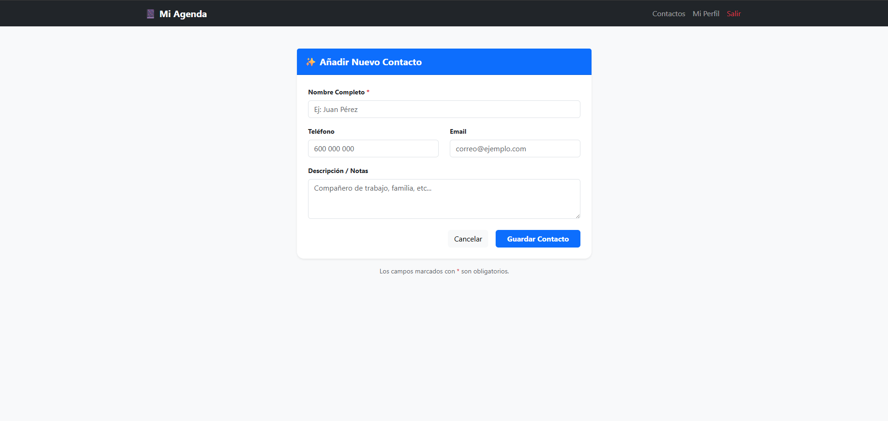
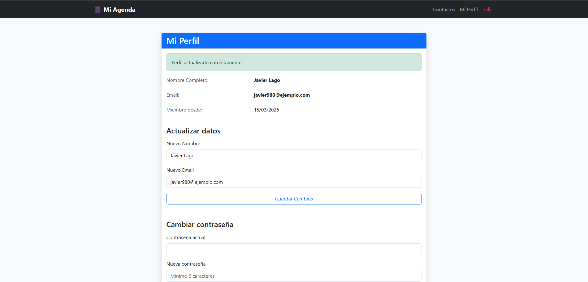

<div align="center">

# 📔 Agenda Pro

### Keep your contacts organised — built from scratch with PHP

*A full-featured contact manager built without frameworks to understand how the web really works.*

<br>


</div>

---

## 🖼️ Screenshots

<table>
  <tr>
    <td align="center"><b>🔐 Login</b></td>
    <td align="center"><b>📋 Contact List</b></td>
  </tr>
  <tr>
    <td></td>
    <td></td>
  </tr>
  <tr>
    <td align="center"><b>➕ New Contact</b></td>
    <td align="center"><b>👤 Profile</b></td>
  </tr>
  <tr>
    <td></td>
    <td></td>
  </tr>
</table>

---

## ✨ What can it do?

| | Feature | Description |
|---|---|---|
| 🔑 | **Authentication** | Register, log in, log out and change your password securely |
| 👥 | **Contact CRUD** | Create, view, edit and delete contacts with name, phone, email and notes |
| 🔍 | **Search** | Filter contacts instantly by name, phone or email |
| 🔃 | **Sorting** | Name A–Z / Z–A, Newest first, Oldest first |
| 📄 | **Pagination** | 6 contacts per page with a *"Showing X–Y of Z contacts"* counter |
| 💬 | **Flash messages** | Auto-dismissing alerts for every create, update and delete action |

---

## 🔒 Security

This project goes beyond a basic tutorial — every common attack vector is addressed:

- 🛡️ **CSRF protection** — every form has a signed session token validated with `hash_equals()` to prevent timing attacks
- 🚦 **Rate limiting** — 5 failed login attempts per IP/email within 15 minutes triggers a lockout
- 🔐 **Bcrypt hashing** — passwords are never stored in plain text
- 💉 **SQL injection prevention** — PDO prepared statements on every single query
- 👁️ **Ownership checks** — every contact query includes `AND user_id = ?` so users can only access their own data
- 📁 **Public directory pattern** — only `public/` is exposed to the web; source code and config live outside the document root
- 🌍 **Environment variables** — credentials stored in `.env` via `vlucas/phpdotenv`, never committed to version control

---

## 🏗️ Architecture

Built on a **custom MVC pattern** — no framework, everything hand-rolled to understand what happens under the hood.

```
Request → public/index.php → routes.php → Controller → Model → View
```

| Layer | Role |
|---|---|
| **Entry point** | Reads `?action=`, resolves the route, enforces auth if required, dispatches to the controller |
| **Controllers** | Validate input, call model methods, pass data to the view |
| **Models** | All SQL lives here — one responsibility per method |
| **Views** | Plain PHP templates — they only print variables, zero business logic |
| **Utils** | Stateless helpers: `Csrf`, `RateLimiter`, `AuthHelper`, `View`, `Logger` |

---

## 📁 Project Structure

```
Agenda/
├── 📂 database/
│   ├── schema.sql              # Table definitions
│   └── datainjector.sql        # Optional seed data
├── 📂 docs/screenshots/        # README images
├── 📂 public/
│   └── index.php               # Web entry point
├── 📂 src/
│   ├── Controllers/
│   │   ├── AuthController.php      # Login · Logout
│   │   ├── ContactController.php   # Contact CRUD + listing
│   │   └── UserController.php      # Registration · Profile
│   ├── Database/
│   │   └── Database.php            # PDO Singleton
│   ├── Models/
│   │   ├── Contact.php
│   │   └── User.php
│   ├── Utils/
│   │   ├── AuthHelper.php          # Session guard
│   │   ├── Csrf.php                # Token generation & validation
│   │   ├── Logger.php              # File-based debug logger
│   │   ├── RateLimiter.php         # Brute-force protection
│   │   └── View.php                # Template renderer
│   └── routes.php
├── 📂 views/
│   ├── auth/                   # login · register
│   ├── contacts/               # index · create · edit
│   ├── layout/                 # header · footer
│   └── user/                   # profile
└── 📂 vendor/                  # Composer dependencies
```

---

## 🚀 Getting Started

> **Requirements:** PHP 8.1+, MySQL, Composer

**① Clone the repo**
```bash
git clone https://github.com/tu-usuario/Agenda.git
cd Agenda
```

**② Install dependencies**
```bash
composer install
```

**③ Import the database**
```bash
mysql -u root -p < database/schema.sql
```

**④ Set up your environment**

Create a `.env` file in the project root:
```ini
DB_HOST=localhost
DB_NAME=agenda_app
DB_USER=root
DB_PASS=your_password
DB_CHARSET=utf8mb4
```

**⑤ Start the server**
```bash
php -S localhost:8000 -t public
```

Open **http://localhost:8000** and you're good to go. 🎉

---

## 🗄️ Database Schema

<details>
<summary>Click to expand</summary>

### `users`
| Column | Type | Notes |
|---|---|---|
| id | INT PK AUTO_INCREMENT | |
| username | VARCHAR(50) UNIQUE | Display name |
| email | VARCHAR(100) UNIQUE | Used for login |
| password | VARCHAR(255) | bcrypt hash |
| created_at | TIMESTAMP | Auto-set |

### `contacts`
| Column | Type | Notes |
|---|---|---|
| id | INT PK AUTO_INCREMENT | |
| user_id | INT FK → users.id | ON DELETE CASCADE |
| name | VARCHAR(100) | Required |
| phone | VARCHAR(20) | Optional |
| email | VARCHAR(100) | Optional |
| description | TEXT | Optional notes |
| created_at | TIMESTAMP | Auto-set |

### `login_attempts`
| Column | Type | Notes |
|---|---|---|
| id | INT PK AUTO_INCREMENT | |
| ip | VARCHAR(45) | Supports IPv6 |
| email | VARCHAR(100) | |
| attempted_at | TIMESTAMP | Indexed for fast range queries |

</details>

---

<div align="center">
  <br>
  <i>Built with curiosity and a lot of PHP by <b>Javier Lago Amoedo</b></i>
</div>
